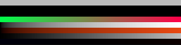
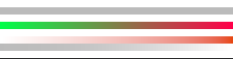
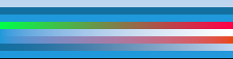
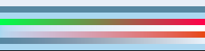

# Approved Windows 16-bit colour/alpha reference content

The scene design is already accepted. This replaces the unapproved
[8-bit proposal](phase-1-golden-candidates-8bit.md) with **five 16-bit PNGs and
five exact binary16 linear readbacks**, produced on the Windows RX 6800 XT.
The owner approved all ten hashes below, bound to `c9397f0`; byte-for-byte
copies are installed under `tests/golden/phase-1/colour-alpha/`. [ADR 0030](../decisions/0030-review-first-colour-alpha-references.md)
records the precision ruling, backend caveat and Phase 4 repeated-blend follow-up.

Measured code: `79113fd8eda86f7a502e69ddaf7e5f3dd3066903`.
Windows evidence: `7f01657015e0ac14f7c2e4161bfcddefa3b52012`.
Backend: D3D12; driver: `32.0.21045.5002`. Source hashes match the measured
revision with Windows CRLF checkout. The RGBA8 input and all scene values
remain unchanged; output is rendered directly at 16-bit precision.

[Large review sheet](phase-1-golden-review.html) ·
[Exact installation manifest](phase-1-colour16-candidate-manifest.json) ·
[Windows report](phase-1-colour16-windows-x86_64/report.json) ·
[Independent audit](phase-1-colour16-windows-x86_64/audit.json).

## Reconstructed results

Both native platforms pass, with every linear maximum independently rebuilt
from serialized raw samples, and every PNG16 channel checked independently.

| Measurement | Windows / D3D12 | M4 / Metal | Bound |
|---|---:|---:|---:|
| Pixels checked | 83,525 | 83,525 | all five scenes |
| Maximum linear absolute error | 0.000959691 | 0.000959691 | ≤0.002 |
| Maximum PNG16 egress error | 1 code value | 1 code value | ≤2 |
| Maximum PNG16 error versus ideal full pipeline | 193 | 193 | recorded separately |
| Failing pixels | 0 | 0 | zero |

The last error statistic includes intermediate half-float rounding. Egress
error compares the actual exported channels to encoding of the observed raw
working samples. Those are different measurements, not alternative thresholds.
The discriminating white-over-black pixel is exactly 0.501953125 in each raw
RGB channel and exports as RGB **48276/65535**, alpha 65535 (about 188 at 8 bits).

All five raw readbacks are 133,640 bytes: 257×65×4 IEEE binary16 values,
RGBA, little-endian, top-to-bottom rows, no padding. All file hashes and PNG
bit depths were verified. To reproduce the audit without a GPU:

```sh
python tools/audit-colour16.py docs/testing/phase-1-colour16-windows-x86_64
```

The [platform comparison](phase-1-colour16-platform-comparison.json) finds
identical raw samples, but **184 of 334,100 exported channel values differ by
one 16-bit code value** (black 16, white 0, colour 40, translucent 88,
transparent 40). Backend byte equality is not expected in general. These
small bounded egress differences are already visible at 16 bits; Phase 3
sampling adds further reasons for perceptual/numerical rather than exact
byte comparisons. Neither backend is substituted for the Windows reference.

## What the bands exercise

Each image is 257×65. Read from top to bottom; each band is eight pixels high,
except the final single-pixel row. Enlargement uses nearest-neighbour display.

| Rows | Foreground input | Expected behavior |
|---|---|---|
| 0–7 | White, alpha 128/255 | Over black: RGB 188 on an 8-bit scale, showing linear-light blending |
| 8–15 | Black, alpha 128/255 | Background attenuated in linear light |
| 16–23 | Magenta, alpha zero | Background unchanged; no hidden-magenta contribution |
| 24–31 | Opaque red/green ramp, blue 73 | Foreground replaces background |
| 32–39 | White, alpha ramp 0–255 | Continuous blend from background to white |
| 40–47 | Orange, alpha ramp 0–255 | Colour and premultiplication stay consistent |
| 48–55 | Grey ramp, alpha 128/255 | sRGB ingest/egress around a linear blend |
| 56–63 | Red/blue ramp, alpha 1/255 | Near-transparent detail without a dark fringe |
| 64 | Opaque RGB 10/11/12 | Values spanning the sRGB transfer breakpoint |

## Windows outputs

The displayed previews are for scene review; viewers may reduce display
precision. Approval binds to the original 16-bit files and raw readbacks below.

**black.png** — Opaque black background.



**white.png** — Opaque white background.



**colour.png** — Opaque RGB 31/153/219 background.



**translucent.png** — RGB 31/153/219, alpha 96/255 background.



**transparent.png** — Hidden magenta, alpha zero background.


## Exact proposed hashes

Approval covers these ten original files, copied byte-for-byte to
`tests/golden/phase-1/colour-alpha/` as listed in the manifest. `input-alpha.png`
is generated input, not reference output. No regeneration during installation.

```text
922b774451dd282348bf2189a3729eec66a6459c05a97a411f6eac0bd05b6226  black.png
a340e950f2b9c9981818f916856cb644bb1b15e78c4d9aa25f565cd4439c3811  black.rgba16f.le
8d342cc99c62ffb07f21f63ed5283955287cfa1766144a608c2a3714a6da8bd0  white.png
7648bfe6f3aff2f4ed48e5ffb272a838c7e1a6647d8b17a8083994e3c631fcc8  white.rgba16f.le
accaff5593703989a761118615b14cd9776f951a36f7f04ab8b029e6141058fb  colour.png
579524da9d52cb7350ffba327d5ac4514e2ee4c2671b37dcfd231ebdacb9ec97  colour.rgba16f.le
cf05555cff70bcfbea84be16f0536e18059260813df21bcef835c47bf353af3a  translucent.png
5b211e8325c83e4c02ae6f0e86e4e99ce4e82f06cd83927d8c7007623a9e3bf0  translucent.rgba16f.le
10f2160ddfadfffce2f7233da283e5874fcc7eb6b3ba68a46bf3b6bf3bb49117  transparent.png
20d7aa9361df4af02cd19b923a4a7a20b8a0fe95d704ac9e238aa8fab2eec5a8  transparent.rgba16f.le
```

Approval of this content does not constitute a passing golden comparison.
The perceptual harness and remaining Phase 1 gate work are still required.
This suite performs one composite operation; ten-overlay accumulation testing
is explicitly deferred to [Phase 4](../phases/04-notes.md).
