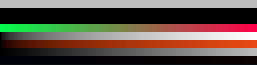
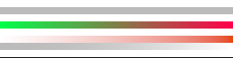
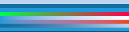
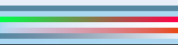

# Historical 8-bit colour/alpha candidates — not approved

**Superseded proposal:** the owner requires 16-bit outputs and raw linear
readbacks before freezing hashes. The scene design is accepted; these 8-bit
hashes are not. A new Windows run and hash proposal are pending (ADR 0030).
The images below remain historical evidence and must not be installed.

These are the original Windows 11 / RX 6800 XT / D3D12 outputs committed in
`92829e8`, using driver `32.0.21045.5002`. No reference files have been installed.
The [large review sheet](phase-1-golden-review.html) displays the same files
with a checkerboard behind transparency; open it locally in a browser.

The requested decision in [ADR 0030](../decisions/0030-review-first-colour-alpha-references.md)
is whether to use these five outputs as the initial colour/alpha golden
content. After approval, copies retain these exact bytes and Windows provenance.

## What the bands exercise

Each image is 257×65. Read from top to bottom; each band is eight pixels high,
except the final single-pixel row. Enlargement uses nearest-neighbour display.

| Rows | Foreground input | Expected behavior |
|---|---|---|
| 0–7 | White, alpha 128/255 | Over black: RGB 188, showing linear-light blending |
| 8–15 | Black, alpha 128/255 | Background attenuated in linear light |
| 16–23 | Magenta, alpha zero | Background unchanged; no hidden-magenta contribution |
| 24–31 | Opaque red/green ramp, blue 73 | Foreground replaces background |
| 32–39 | White, alpha ramp 0–255 | Continuous blend from background to white |
| 40–47 | Orange, alpha ramp 0–255 | Colour and premultiplication stay consistent |
| 48–55 | Grey ramp, alpha 128/255 | sRGB ingest/egress around a linear blend |
| 56–63 | Red/blue ramp, alpha 1/255 | Near-transparent detail without a dark fringe |
| 64 | Opaque RGB 10/11/12 | Values spanning the sRGB transfer breakpoint |

## Windows output candidates

**Black** — opaque RGB 0/0/0 background.



**White** — opaque RGB 255/255/255 background.



**Colour** — opaque RGB 31/153/219 background.



**Translucent** — RGB 31/153/219, alpha 96/255 background. Display appearance
depends on the viewer's background; the saved PNG retains output alpha.



**Transparent** — magenta with alpha zero as background. Hidden RGB contributes
nothing; output transparency survives export.


## Evidence and exact approval scope

[Windows report](phase-1-colour-windows-x86_64/report.json),
[M4 report](phase-1-colour-macos-aarch64/report.json),
[independent exported-pixel audit](phase-1-colour-windows-audit.json).

| Result | Windows / D3D12 | M4 / Metal |
|---|---:|---:|
| Pixels checked | 83,525 | 83,525 |
| Reported maximum linear absolute error | 0.000959691 | 0.000959691 |
| Maximum exported channel error | 1 code value | 1 code value |
| Failing pixels | 0 | 0 |

The Windows exported errors were independently recomputed from the committed
PNGs. Raw linear readbacks are absent from the report; their maxima above are
producer-reported. Decoded Windows and M4 RGBA bytes match for all five cases.
Future comparisons still use perceptual tolerances, not byte equality.

File SHA-256 values defining this proposed set:

```text
d326eb4a74822107728806adb08592d9e3386f08e4eab014400b47c94eb1cee4  black.png
7753e8d354d97f99166d2960dd84f86eb27f97778556c8ee4ed157ac3b7cc951  white.png
64e51526ccfb6df5be5b760cd835fadfe5238f0c350782d1338e6c40e96b1c05  colour.png
a66f77a09a3cd1ab7c42895fc9a484575a046a1e0706f0c42073fa455a0fbb80  translucent.png
d4b494738b644310a3099f93669e16ebf966ed841eaeb775be62d5175fecbbc5  transparent.png
```

No golden comparison or Phase 1 gate is declared passed by this proposal.
